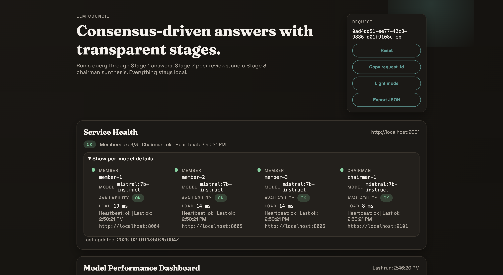
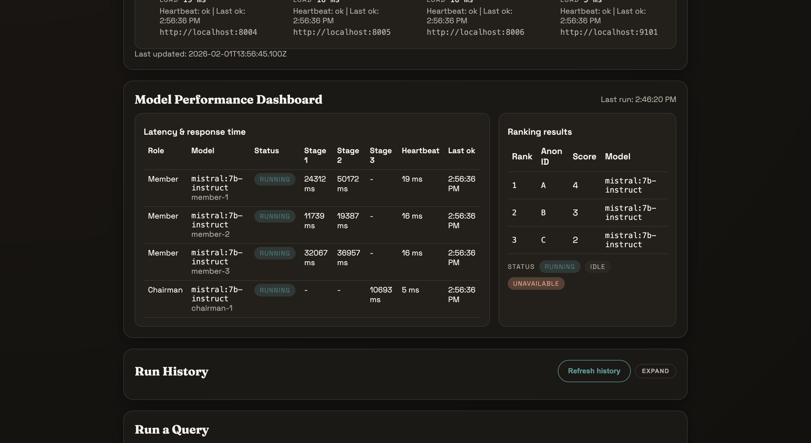
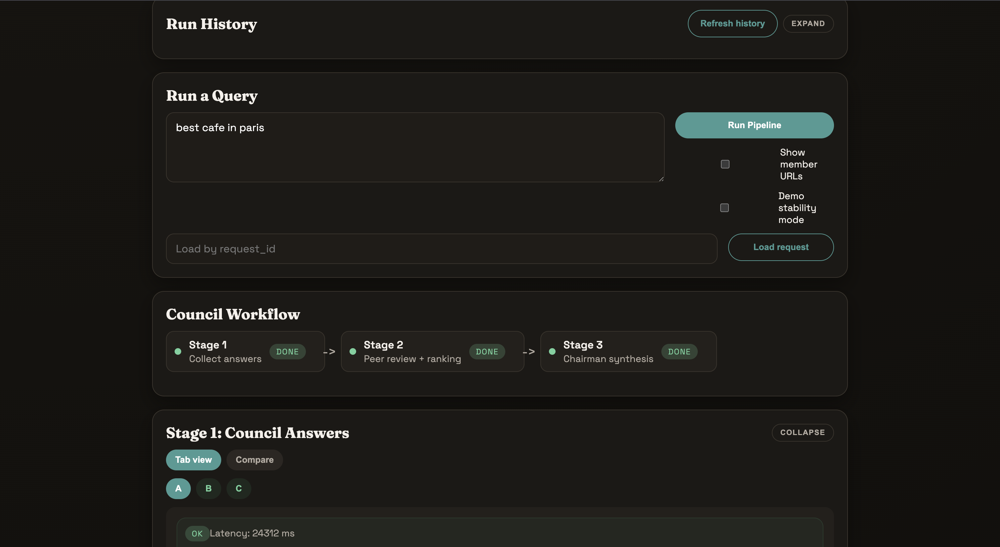
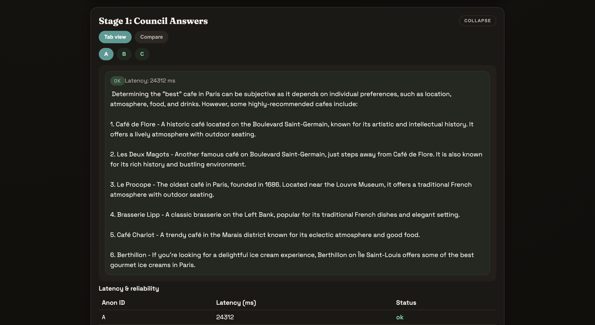
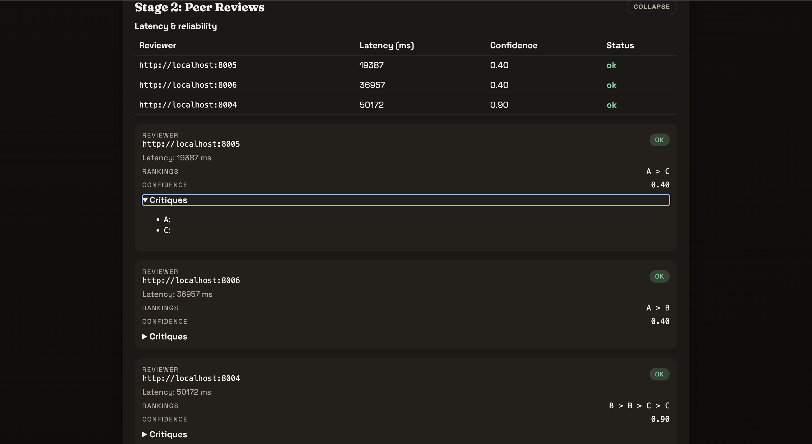
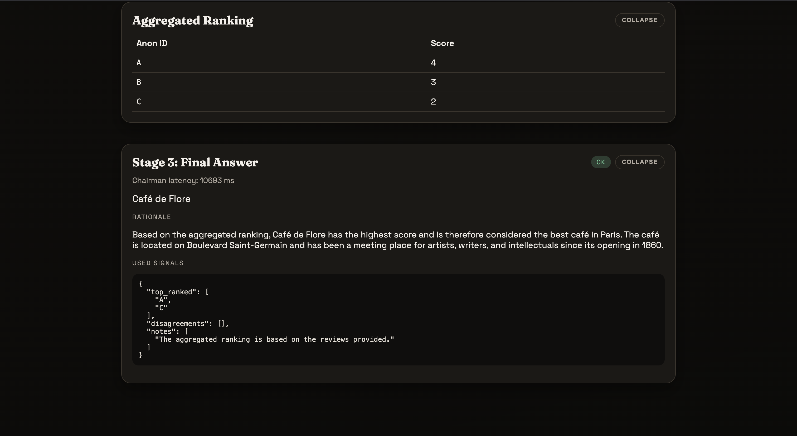

# LLM Council (Local, Distributed)

Local-first multi-model LLM council that orchestrates answers, anonymized peer review, and chairman synthesis entirely on local Ollama.

## 30-second overview
LLM Council is a local-only, multi-service orchestration pattern that gathers answers from multiple models, runs anonymized peer review, and synthesizes a final response with a chairman model while tracking health, latency, and reproducible run history.
- Local-only inference via Ollama (no cloud providers)
- 3-stage pipeline: answer -> anonymized peer review -> chairman synthesis
- Strict JSON/Zod API contracts + validation
- Observability + SQLite run history + UI

## 3-minute Quickstart
```bash
npm install
npm --prefix orchestrator install
npm --prefix chairman install
npm --prefix ui install

cp .env.example .env
cp orchestrator/.env.example orchestrator/.env
cp chairman/.env.example chairman/.env
cp ui/.env.example ui/.env

./scripts/run_all_local.sh
open http://localhost:5173
```

## Demo
<table>
  <tr>
    <td></td>
    <td></td>
    <td></td>
  </tr>
  <tr>
    <td>Overview + health</td>
    <td>Stage 1 answers + latency</td>
    <td>Stage 2 reviews + critiques</td>
  </tr>
  <tr>
    <td></td>
    <td></td>
    <td></td>
  </tr>
  <tr>
    <td>Aggregated ranking</td>
    <td>Chairman synthesis</td>
    <td>Run history + export</td>
  </tr>
</table>

## For reviewers
- `orchestrator/src/server.ts` — stage coordination + persistence + heartbeat.
- `src/server.ts` — member answer + review pipeline.
- `chairman/src/server.ts` — synthesis contract + strict JSON enforcement.
- `orchestrator/src/anonymize.ts` and `orchestrator/src/aggregate.ts` — anonymization + Borda-style aggregation.
- `ui/` — pipeline runner + stage visualizations.

## Security & Privacy
- Local-only inference via Ollama; no cloud model calls.
- Run history stored locally in SQLite and can be disabled via env vars.
- No auth or rate limiting by default (intended for local demos).

## Project facts
- Project type: Solo project
- Author: Syed Mohammad Shah Mostafa
- TD group: N/A (solo project)

## Table of contents
- 30-second overview
- 3-minute Quickstart
- Demo
- For reviewers
- Security & Privacy
- Project facts
- Overview
- Quickstart (local)
- Architecture
- Pipeline stages (Stage 1-3)
- Services and responsibilities
- API contracts (requests/responses)
- Anonymization and aggregation details
- Persistence and run history
- Health, heartbeat, and observability
- UI features
- Configuration (env vars)
- Models and role profiles
- Scripts and local workflows
- Testing and verification
- Multi-machine deployment (LAN)
- Directory structure
- Roadmap
- Limitations
- Generative AI usage statement

## Overview
LLM Council is a local, distributed orchestration pattern for multi-model consensus. It separates roles into independent services:
- Council members: generate answers and review peers.
- Orchestrator: coordinates stages, anonymizes answers, aggregates rankings, and persists state.
- Chairman: synthesizes the final response from provided signals only.
- UI: runs the pipeline and visualizes each stage with latency and health data.

Key properties:
- Local-only inference via Ollama.
- Strict JSON schemas and validation between services.
- Partial failure tolerance in Stage 1 and Stage 2.
- SQLite-backed run history for reproducible demos.

## Quickstart (local)

Prerequisites:
- Node.js 18+ and npm
- Ollama installed and running locally

Install dependencies:
```bash
npm install
npm --prefix orchestrator install
npm --prefix chairman install
npm --prefix ui install
```

Configure env files (optional, defaults are already provided in the repo):
```bash
cp .env.example .env
cp orchestrator/.env.example orchestrator/.env
cp chairman/.env.example chairman/.env
cp ui/.env.example ui/.env
```

Start everything:
```bash
./scripts/run_all_local.sh
```

Open the UI:
```bash
open http://localhost:5173
```

Stop everything:
```bash
./scripts/stop_all_local.sh
```

## Architecture

```
User -> UI (Vite, 5173) -> Orchestrator (9000)
                           |-> Council Member A (8001)
                           |-> Council Member B (8002)
                           |-> Council Member C (8003)
                           `-> Chairman (9100)

Stage 1: Orchestrator -> Members /answer
Stage 2: Orchestrator -> Members /review (anonymized)
Stage 3: Orchestrator -> Chairman /synthesize
```

All LLM inference calls are local:
- Members call Ollama `POST /api/chat` via `src/ollamaClient.ts`.
- Chairman calls Ollama `POST /api/chat` via `chairman/src/ollamaClient.ts`.
- Orchestrator never calls the model; it is coordination-only.

## Pipeline stages (Stage 1-3)

Stage 1: Answer collection
- Orchestrator fans out `POST /answer` to all members.
- Each member returns its answer, latency, and optional token usage.
- Orchestrator stores per-member results and assigns anon IDs (A, B, C...).
- Stage 1 is tolerant of partial member failures.

Stage 2: Anonymized peer review
- Orchestrator sends each member a peer-only list (their own answer is excluded).
- Reviews contain rankings (best to worst), critiques, and confidence.
- If fewer than 2 successful answers exist, Stage 2 fails fast.
- Orchestrator aggregates rankings into a single score table.

Stage 3: Chairman synthesis
- Orchestrator sends anonymized answers, reviews, and aggregated ranking to the chairman.
- Chairman returns `final_answer`, `rationale`, and `used_signals`.
- Stage 3 requires Stage 2 aggregated ranking and at least 1 answer.

## Services and responsibilities

Council member (`src/server.ts`)
- Endpoints: `GET /health`, `POST /answer`, `POST /review`.
- Uses role-specific prompts in `src/prompts.ts`.
- Enforces strict JSON output for reviews; falls back to a safe review format if model JSON is invalid.
- `MODEL_NAME` is required; Ollama health is checked via `/api/tags`.

Orchestrator (`orchestrator/src/server.ts`)
- Endpoints: `GET /health`, `GET /heartbeat`, `POST /stage1`, `POST /stage2`, `POST /stage3`, `GET /request/:id`, `GET /runs`, `GET /runs/:id`, `DELETE /runs/:id`.
- Coordinates stages, anonymization, aggregation, and persistence.
- Aggregates rankings with a score-based method (see below).
- Tracks per-service heartbeat and exposes a snapshot in `/health` and `/heartbeat`.

Chairman (`chairman/src/server.ts`)
- Endpoints: `GET /health`, `POST /synthesize`.
- Uses `chairman/src/prompts.ts` to enforce synthesis-only output.
- Requires strict JSON and returns an error if the model output is not valid JSON.

UI (`ui/`)
- Runs the pipeline via the orchestrator API.
- Visualizes answers, reviews, ranking, and synthesis.
- Shows health, per-model latency, run history, and JSON export.

## API contracts (requests/responses)

All endpoints use JSON and are validated with Zod schemas.

### Orchestrator

`POST /stage1`
Request:
```json
{
  "query": "string",
  "options": { "temperature": 0.7 }
}
```
Response (per member):
```json
{
  "request_id": "uuid",
  "query": "string",
  "answers": [
    {
      "anon_id": "A",
      "answer_text": "string",
      "member_url": "http://host:port",
      "latency_ms": 1234,
      "token_usage": { "prompt_tokens": 10, "completion_tokens": 20, "total_tokens": 30 },
      "status": "ok"
    },
    {
      "anon_id": "",
      "answer_text": "",
      "member_url": "http://host:port",
      "status": "error",
      "error": "message"
    }
  ]
}
```

`POST /stage2`
Request:
```json
{ "request_id": "uuid", "options": { "temperature": 0.2 } }
```
Response:
```json
{
  "request_id": "uuid",
  "reviews": [
    {
      "reviewer_url": "http://host:port",
      "status": "ok",
      "rankings": ["A", "B", "C"],
      "critiques": { "A": "...", "B": "..." },
      "confidence": 0.7,
      "latency_ms": 800,
      "token_usage": { "prompt_tokens": 12, "completion_tokens": 18, "total_tokens": 30 }
    }
  ],
  "aggregated_ranking": [
    { "anon_id": "A", "score": 6 },
    { "anon_id": "B", "score": 4 },
    { "anon_id": "C", "score": 2 }
  ]
}
```

`POST /stage3`
Request:
```json
{ "request_id": "uuid", "options": { "temperature": 0.3 } }
```
Response:
```json
{
  "request_id": "uuid",
  "status": "ok",
  "final_answer": "string",
  "rationale": "string",
  "used_signals": {
    "top_ranked": ["A"],
    "disagreements": ["B"],
    "notes": ["signal 1", "signal 2"]
  },
  "latency_ms": 1500,
  "token_usage": { "prompt_tokens": 20, "completion_tokens": 40, "total_tokens": 60 }
}
```

Additional orchestrator endpoints:
- `GET /health`: aggregated health + heartbeat snapshot.
- `GET /heartbeat`: heartbeat snapshot only.
- `GET /request/:id`: returns full request state in memory.
- `GET /runs?limit=20`: list persisted runs.
- `GET /runs/:id`: load run from memory or SQLite.
- `DELETE /runs/:id`: delete from memory + SQLite.

### Council member

`POST /answer`
Request:
```json
{ "request_id": "uuid", "query": "string", "options": { "temperature": 0.7 } }
```
Response:
```json
{
  "member_id": "member-1",
  "answer_text": "string",
  "latency_ms": 900,
  "token_usage": { "prompt_tokens": 12, "completion_tokens": 18, "total_tokens": 30 }
}
```

`POST /review`
Request:
```json
{
  "request_id": "uuid",
  "query": "string",
  "peer_answers": [
    { "anon_id": "A", "answer_text": "..." },
    { "anon_id": "B", "answer_text": "..." }
  ],
  "options": { "temperature": 0.2 }
}
```
Response:
```json
{
  "member_id": "member-1",
  "rankings": ["A", "B"],
  "critiques": { "A": "...", "B": "..." },
  "confidence": 0.6,
  "latency_ms": 700,
  "token_usage": { "prompt_tokens": 10, "completion_tokens": 12, "total_tokens": 22 }
}
```

### Chairman

`POST /synthesize`
Request:
```json
{
  "request_id": "uuid",
  "query": "string",
  "answers": [
    { "anon_id": "A", "answer_text": "..." },
    { "anon_id": "B", "answer_text": "..." }
  ],
  "reviews": [
    {
      "reviewer_anon": "A",
      "rankings": ["A", "B"],
      "critiques": { "A": "..." },
      "confidence": 0.8
    }
  ],
  "aggregated_ranking": [
    { "anon_id": "A", "score": 2 },
    { "anon_id": "B", "score": 1 }
  ],
  "options": { "temperature": 0.3 }
}
```
Response:
```json
{
  "chairman_id": "chairman-1",
  "final_answer": "string",
  "rationale": "string",
  "used_signals": {
    "top_ranked": ["A"],
    "disagreements": ["B"],
    "notes": ["...", "..."]
  },
  "latency_ms": 1200,
  "token_usage": { "prompt_tokens": 15, "completion_tokens": 22, "total_tokens": 37 }
}
```

Token usage is a heuristic estimate based on characters (approx 4 chars per token).

## Anonymization and aggregation details

Anonymization
- Orchestrator sorts member URLs and assigns anon IDs in order: A, B, C, ...
- Reviews only see anon IDs, not member URLs.
- Each reviewer is excluded from its own peer set.

Aggregation
- Aggregation uses a score-per-rank method (Borda-like):
  - For a ranking of length N, top choice gets N points, next gets N-1, etc.
  - Scores are summed across all successful reviews.
- Aggregated ranking is sorted by score (desc), then anon ID.

## Persistence and run history
- In-memory store holds the active request state.
- SQLite persistence stores full `RequestState` after each stage.
- SQLite is configured with WAL mode and a runs table:
  - `runs(request_id, created_at, query, state_json)`
- On startup, the orchestrator can bootstrap a recent subset of runs into memory.

Relevant env vars:
- `PERSISTENCE_ENABLED=true|false`
- `PERSISTENCE_DB=./data/orchestrator.db`
- `PERSISTENCE_BOOTSTRAP_LIMIT=20`

The UI can load, delete, and export persisted runs.

## Health, heartbeat, and observability

Health checks
- Members and chairman expose `GET /health` and validate Ollama via `/api/tags`.
- Orchestrator `GET /health` aggregates member + chairman health.

Heartbeat
- Orchestrator runs a background heartbeat monitor with configurable interval and timeout.
- Snapshot includes: last ok/error times, latency, and consecutive failure counts.
- Exposed in `GET /health` and `GET /heartbeat`.

UI observability
- Health bar + per-model details (model name, ID, latency, last ok).
- Latency tables per stage.
- Per-model status (idle/running/unavailable).

## UI features
- Stage 1 answers in tabs (A/B/C) with latency and error panels.
- Compare mode with diff highlights against a chosen baseline.
- Stage 2 review list with rankings, critiques, confidence, and latency.
- Aggregated ranking table.
- Stage 3 final answer, rationale, and used signals.
- Run history (load/delete) and JSON export.
- Demo stability mode (forces `temperature=0`).
- Theme toggle (light/dark) and optional debug view of member URLs.

## Configuration (env vars)

Council member (root)
- `MODEL_NAME` (required)
- `MEMBER_ID` (default: `member-1`)
- `OLLAMA_BASE_URL` (default: `http://localhost:11434`)
- `PORT` (default: `8001`)
- `ROLE_PROFILE` (optional, appended to prompts)

Orchestrator
- `PORT` (default: `9000`)
- `COUNCIL_MEMBERS` (comma-separated URLs, required)
- `ORCH_TIMEOUT_MS` (default: `60000`)
- `CHAIRMAN_URL` (default: `http://localhost:9100`)
- `CORS_ORIGINS` (comma-separated allowed origins; localhost ports are also allowed)
- `PERSISTENCE_ENABLED` (`true|false`, default: `true`)
- `PERSISTENCE_DB` (default: `./data/orchestrator.db`)
- `PERSISTENCE_BOOTSTRAP_LIMIT` (default: `20`)
- `HEARTBEAT_INTERVAL_MS` (default: `15000`)
- `HEARTBEAT_TIMEOUT_MS` (default: `5000`)

Chairman
- `MODEL_NAME` (required)
- `CHAIRMAN_ID` (default: `chairman-1`)
- `OLLAMA_BASE_URL` (default: `http://localhost:11434`)
- `PORT` (default: `9100`)
- `TIMEOUT_MS` (default: `90000`)

UI
- `VITE_ORCH_URL` (default: `http://localhost:9000`)

Script-only env vars
- `PULL_MISSING_MODELS=1` (auto-pull missing Ollama models for members)
- `OLLAMA_FORCE_CPU=1` (start Ollama in CPU-only mode in `run_all_local.sh`)

## Models and role profiles
- Default member models are configured in `.env.member1`, `.env.member2`, `.env.member3`.
- The chairman model is configured in `chairman/.env`.
- `ROLE_PROFILE` can be set per member to influence answer/review style (e.g., engineer, skeptic).
- `scripts/run_members_local.sh` falls back to `mistral:7b-instruct` if a model is missing.

## Scripts and local workflows

Core scripts:
- `./scripts/run_all_local.sh` - starts Ollama (if needed), members, orchestrator, chairman, UI.
- `./scripts/run_members_local.sh` - starts 3 local member services using `.env.member1/2/3`.
- `./scripts/run_ui.sh` - starts the UI only.
- `./scripts/stop_all_local.sh` - stops all services by PID.
- `./scripts/demo.sh` - run end-to-end demo + Playwright verification.

Smoke tests:
- `./scripts/smoke.sh` - health/answer/review against a single member.
- `./orchestrator/scripts/smoke_orchestrator.sh` - stage1-3 run via orchestrator.

## Testing and verification

UI tests (Playwright):
```bash
cd ui && npm run test:ui:install
cd ui && npm run test:ui
```

Orchestrator smoke:
```bash
./orchestrator/scripts/smoke_orchestrator.sh
```

## Multi-machine deployment (LAN)

Templates and scripts live under `deploy/`.

Steps:
1) Copy env templates in `deploy/env/` to each host and set LAN IPs.
2) Set `COUNCIL_MEMBERS` and `CHAIRMAN_URL` to LAN URLs.
3) Run services on each host (`npm run dev` per service).
4) Verify with:
   - `./deploy/scripts/check_health.sh /path/to/cluster.env`
   - `./deploy/scripts/ping_cluster.sh /path/to/cluster.env`

Optional: systemd unit templates in `deploy/systemd`.

## Directory structure
- `src/` - council member service (answer + review)
- `orchestrator/src/` - orchestrator service (stages + persistence + heartbeat)
- `chairman/src/` - chairman synthesis service
- `ui/` - React UI (Vite)
- `scripts/` - local start/stop/demo helpers
- `deploy/` - LAN deployment kit and templates
- `docs/` - architecture, env audit, technical report
- `packages/inference/` - provider-agnostic interface stub (future integration)

## Roadmap
- Consolidate inference clients (share a single Ollama client or use `packages/inference`).
- Add lint/format tooling and CI checks.
- Add orchestrator unit tests (anonymization, aggregation, stage workflows).
- Add retry/backoff policies for transient member failures.
- Add auth or rate limiting for non-local deployments.

## Limitations
- In-memory state is volatile and not shared across orchestrator instances.
- No authentication or rate limiting (intended for local demo use).
- UI tests assume local services are available.
- Model output quality depends on locally installed models and hardware.

## Generative AI usage statement
- Purpose: This project demonstrates a local-first, multi-agent LLM Council pipeline for research and demos.
- Models: Local Ollama models (default: `mistral:7b-instruct`).
- Data handling: Prompts and outputs are stored locally in SQLite for run history; no cloud storage is used.
- Limitations: Model outputs can be incomplete or inaccurate and should be validated.
- Consent: By running the demo, you consent to AI-generated outputs for testing purposes.
- Development: I used Codex as a coding assistant, validated changes locally, ran tests, fixed issues, and made final integration decisions.
